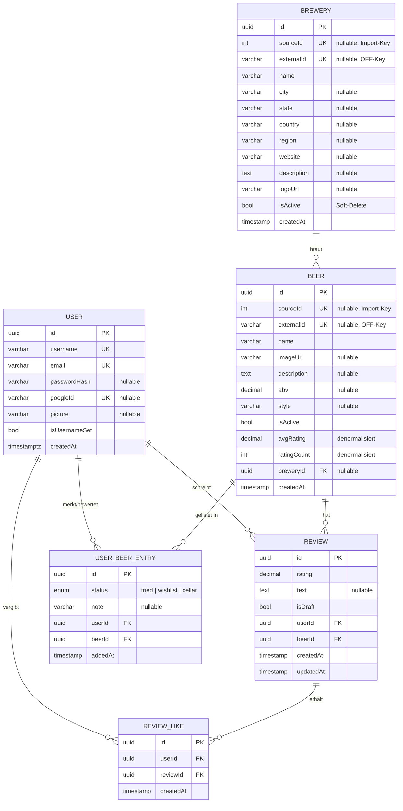

# Entity-Relationship-Modell

Datenmodell des Bierportals (TypeORM-Entities, PostgreSQL). Die IDs sind UUIDs,
Zeitstempel werden von TypeORM (`@CreateDateColumn` / `@UpdateDateColumn`) gesetzt.

## Diagramm

## Beziehungen

| Von | Nach | Kardinalität | Löschverhalten | Besonderheit |
|-----|------|--------------|----------------|--------------|
| `Brewery` | `Beer` | 1 : n | – | `beer.brewery` ist `nullable` (verwaiste Import-Biere bleiben erhalten) |
| `User` | `Review` | 1 : n | `ON DELETE CASCADE` | `UNIQUE(user, beer)` – ein Review pro Nutzer & Bier |
| `Beer` | `Review` | 1 : n | – | |
| `User` | `ReviewLike` | 1 : n | `ON DELETE CASCADE` | `UNIQUE(user, review)` – ein Like pro Nutzer & Review |
| `Review` | `ReviewLike` | 1 : n | `ON DELETE CASCADE` | |
| `User` | `UserBeerEntry` | 1 : n | `ON DELETE CASCADE` | `UNIQUE(user, beer, status)` |
| `Beer` | `UserBeerEntry` | 1 : n | – | |

## Hinweise

- **`avgRating` / `ratingCount`** an `Beer` sind bewusst denormalisiert (aus `Review`
  aggregiert), um Listen ohne Join berechnen zu können.
- **`isActive`** an `Beer` und `Brewery` ist ein Soft-Delete-Flag: Datensätze werden
  ausgeblendet statt gelöscht, damit abhängige Reviews/Einträge erhalten bleiben.
- **`sourceId` / `externalId`** sind Upsert-Schlüssel der Seed-Importe (Open Beer
  Database bzw. Open Food Facts) und verhindern Duplikate bei erneutem Seeding.
- Ein `User` kann sich per Passwort **oder** Google anmelden (`passwordHash` bzw.
  `googleId`); mindestens eines der beiden ist gesetzt.
